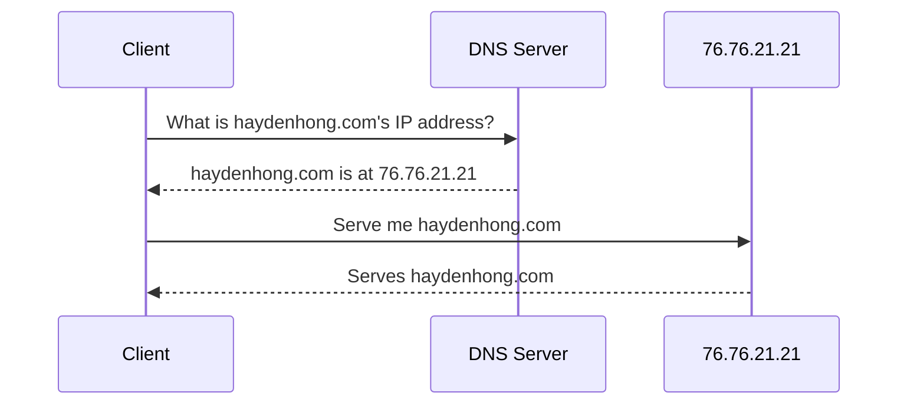
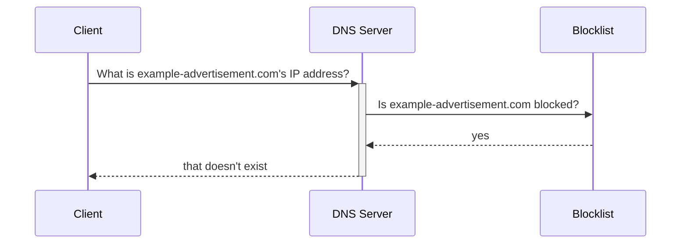

import { Callout } from "nextra/components";

# Ad-Blocking via DNS

Advertisements are a scourge and should be blocked by all means available.
I have no moral high ground I'm trying to push, I just plain hate being advertised to.

<Callout type="info">
  Don't forget to [ditch Google
  Chrome](https://www.eff.org/deeplinks/2021/12/googles-manifest-v3-still-hurts-privacy-security-innovation);
  Google is removing your ability to block ads through extensions.
</Callout>

[Ad-blocking extensions](https://ublockorigin.com) are great, but are limited to blocking ads
in your web browser (which, again, shouldn't be Google Chrome).

## What is DNS?

<Callout type="info">
  This is a pretty massive over-simplification of how DNS works. If you're
  curious and want to learn more, [nslookup.io has an excellent learning
  center](https://www.nslookup.io/learning/).
</Callout>

The [Domain Name System (DNS)](https://en.wikipedia.org/wiki/Domain_Name_System) is like the phone book of the Internet.
When your device wants to know how to get the IP address of a domain name like haydenhong.com, it requests it from a DNS server.

At a high level, it looks like this:

## How DNS servers can block ads

Ad-blocking DNS servers maintain a blocklist for blocked domain names. Before providing a domain name's IP address, the DNS server checks if the domain name is in the blocklist.

If the domain name is in the blocklist, the DNS server responds saying it can't resolve the IP address and leaves it
up to the client to figure out how to handle an unreachable domain.

### Limitations

If a domain name serves both useful content _and_ ads, DNS ad-blocking won't work.

For example, youtube.com probably shouldn't be on a blocklist because most people use YouTube. YouTube serves their ads
directly from youtube.com, so ads cannot be blocked via DNS; Blocking ads at a DNS level would block YouTube entirely.

If YouTube served ads from a [subdomain](https://en.wikipedia.org/wiki/Subdomain) like ads.youtube.com, DNS-based ad-blocking would work.

### Oddities

There are a few places where clients have a hard time recovering from blocked DNS requests.
Often times this is because a link redirects through a tracker, which might be blocked and break the action you were trying to perform.

I've noticed this frequently in:

- Captive portals (a common pattern for signing into public or airplane WiFi)
- Unsubscribe links in emails
- "Please disable your ad-blocker" on some sites

## Ad-Blocking DNS Choices

This is a **non-exhaustive** list of ad-blocking DNS servers that I have used and enjoyed.

### Mullvad DNS

<Callout emoji="🏆">This is the one I'm using now!</Callout>

[Mullvad's encrypted DNS service](https://mullvad.net/en/help/dns-over-https-and-dns-over-tls) is **free** and
pretty slick to set up.

#### Setting up

The full instructions can be found on [Mullvad's encrypted DNS page](https://mullvad.net/en/help/dns-over-https-and-dns-over-tls).

I use almost exclusively Apple devices, so I [downloaded the base profile](https://github.com/mullvad/encrypted-dns-profiles/raw/main/base/mullvad-encrypted-dns-tls-base.mobileconfig) and installed it.

### NextDNS

[NextDNS](https://nextdns.io), [a paid service](https://nextdns.io/pricing), provides a lot of configurability.
You can add whatever public blocklists you want, or make your own.

There are a lot of other features too, like per-device profiles and nice dashboard to view your recent DNS requests.

Setup instructions can be found on NextDNS' website.

### Pi-Hole

Don't trust anyone else to block DNS requests for you? [Pi-Hole](https://pi-hole.net) is a DIY way to run an ad-blocking DNS server.

#### Setting up

The instructions can be found on [the Pi-Hole website](https://pi-hole.net).
Setting up Pi-Hole is a great beginner project!

<Callout type="warning">
  Don't make your Pi-Hole setup a public DNS server! You might end up
  accidentally contributing to a [DNS amplification
  attack](https://docs.pi-hole.net/guides/dns/unbound/).
</Callout>

You can add onto your DIY project by [configuring your server to also run its own DNS resolver](https://docs.pi-hole.net/guides/dns/unbound/),
or make it accessible outside your home with [PiVPN](https://pivpn.io).
