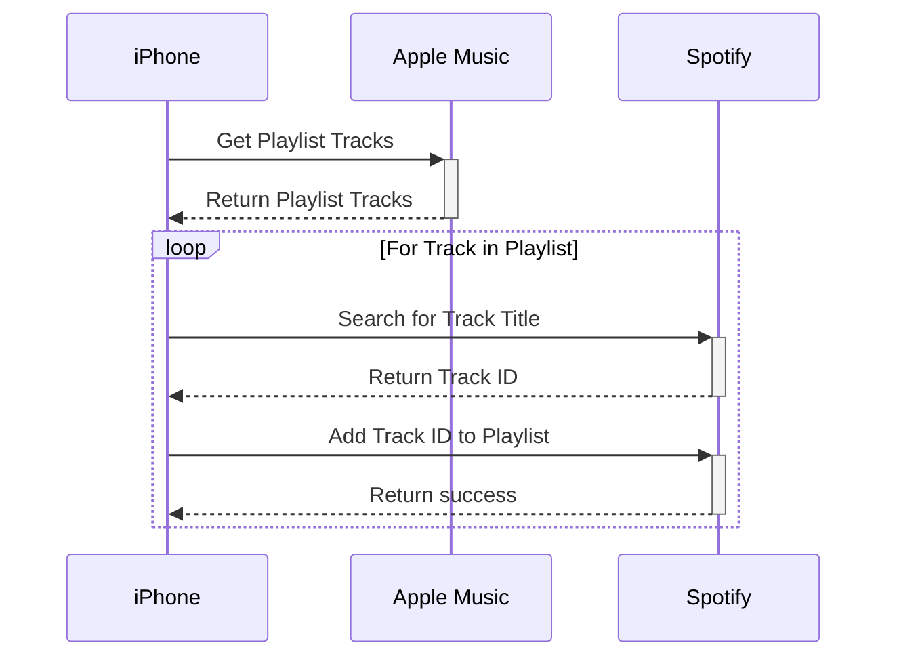

import { Callout } from "nextra/components";
import { Steps } from "nextra/components";

# Convertify iOS

In college, [Convertify](https://github.com/AFRUITPIE/Convertify) was my first major personal project.

The goal of Convertify was to convert Spotify Playlists to Apple Music and vice versa.

It ended up receiving tens of thousands of downloads on the App Store which was exciting, but was ultimately
shut down due to the effort required to maintain an iOS app.

## Architecture

Convertify was designed as a local-only system to keep cost at a minimum.
The $99 Apple Developer fee was already more than I wanted to spend as a college student.

<Steps>
### Get Playlist tracks from source

For the Playlist source, Convertify made an API call to retrieve the Playlist's tracks.

In both Apple Music and Spotify, each track comes with a unique ID. These IDs are not the same across services, however.

### Search for similar tracks in destination

To figure out which track ID to add to the destination playlist, Convertify called the destination's search API.

A search request similar to this was made:

```json
{
  "track": "Keep Moving",
  "artist": "Jungle"
}
```

Repeat this for every track in the source playlist, and we had the track IDs that we wanted to add to the destination playlist.

### Populate destination with tracks

For all the track IDs in the previous step (batched when supported), Convertify would call the destination's API and
to append the track.

</Steps>



### Benefits of local-only architecture

The local-only architecture had these major benefits:

- $0 infrastructure cost (because there was no infrastructure)
- User privacy (because I had nowhere to log anything)

### Drawbacks of local-only architecture

The local-only architecture, while cheap, was almost certainly the wrong decision to make.

- Each patch required a new App Store release
- Users had to keep the app open while converting Playlists
  - Unnecessary battery drain with hundreds of network calls
- No insight into system health

## Struggles I had

Convertify was the first piece of software I made that people actually used.
It was a much larger undertaking than I originally expected!

### So many edge cases

Apple Music and Spotify are constantly in an arms race to see who can add the most features, and it consistently
broke Convertify.

Music videos, podcasts, "radio stations", and more edge cases kept popping up as new features rolled out.

It was like playing whack-a-mole but instead of moles I was wacking new bugs that came up with Spotify added
grocery shopping functionality.

### App Store woes

Submiting an app the the App Store was a surprisingly large pain.
New revisions have a lengthy review process, and each review requires a lot of work.

### API abstraction

Rather than using a slick library like [Moya](https://github.com/Moya/Moya) to wrap the Apple Music and Spotify APIs, I spread the
networking layer around the codebase. This was simply because I didn't know any better at the time. _Oops._

## What if I built it today?

If I built Convertify today, I would make use of an workflow orchestration system like
[Logic Apps in Azure](https://learn.microsoft.com/en-us/azure/logic-apps/logic-apps-overview) or [Step Functions in AWS](https://aws.amazon.com/step-functions/).

That way I could:

- Make small fixes to edge cases without having to update the client App(s) as well
- Allow users to close Convertify while converting
- Retry and back-off more easily
- Gain insights into Convertify's health
